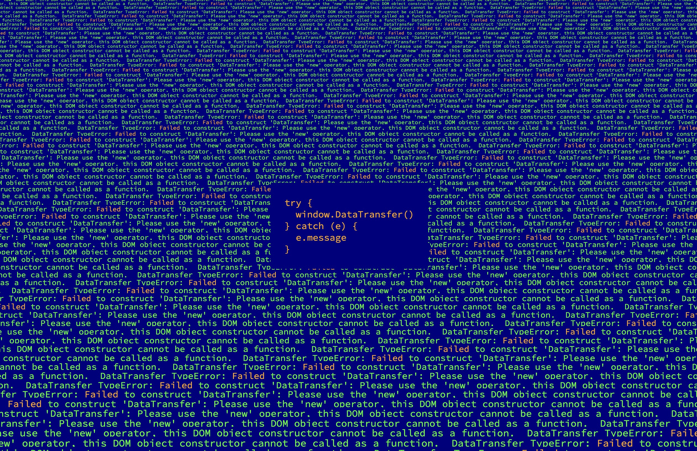

# inside window (BYOD ver.)

## 解説

《inside window (BYOD ver.)》 は、コード詩とジェネレーティブアートを融合した作品です。この作品を実行すると、実行されているブラウザの window オブジェクトの中からすべての関数をみつけだし、その中からひとつの関数を選んで呼び出します。関数呼び出しによって返ってくるものは、自分自身の奥底に存在するエラーメッセージの言葉です。そこには想像もできない広大な地平が広がっています。これは、ジェネレーティブアートそれ自体が自己をみつめる内省的な作品であり、まったく新しい生成詩です。

## URL

https://byod2025.web.app/inside-window

## ソースコード

https://github.com/avcdsld/byod

## 作者

荒川 零一 / Zeroichi Arakawa

https://zeroichiarakawa.com
