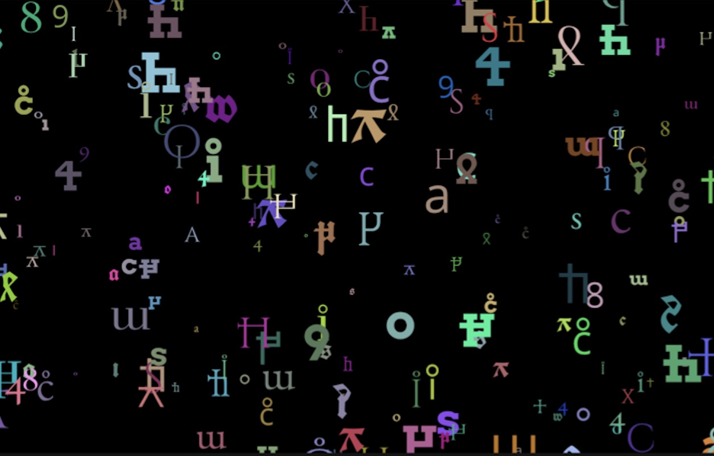

# Lost Language (BYOD ver.)

## 解説

この世界には、もはや解読できない文字やデータが溢れ、それらの数は増え続けています。デジタルの世界でも同じことが言えます。この作品では、自作のフォントを p5.js に読み込むことで、デジタル空間をさまよう「失われた言語」を表現しました。

## URL

https://byod2025.web.app/lost-language

## ソースコード

https://github.com/avcdsld/byod

## 作者

荒川 零一 / Zeroichi Arakawa 
https://zeroichiarakawa.com
