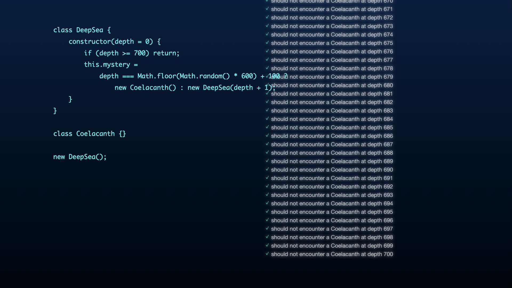

# DeepSea (BYOD ver.)

## 解説

この作品は、JavaScript で書かれた短い詩を、テストという行為を通じて探求する試みです。テストはソフトウェア開発において重要なプロセスであり、コードの実行結果を検証するために様々なツールが開発されています。この作品では JavaScript 用のテストフレームワーク Mocha を組み込み、ブラウザ上でコードのテストを繰り返し行います。 作品の中心には「DeepSea」と名付けたクラスがあります。このクラスは再帰的なコンストラクタを持ち、インスタンス化されると内部変数「mystery」に別のインスタンスを格納します。そのインスタンスはほとんどの場合、同じ「DeepSea」クラスのインスタンスですが、深く深く潜った場合、低い確率で古代魚のインスタンスが格納されることがあります。 私は、このような構造をプログラミング言語の持つ独自の価値と捉えています。視覚化されていなくとも、この構造そのものがジェネラティブアートと呼べるのではないかと考えています。テストフレームワークは、その内部状態を解き明かし、共有する手段を提供します。これは期待と現実のギャップを明らかにし、古代魚がまだ生きているという歴史的な出来事を思い出させます。この作品が、テストとコード作品の関係について考えるきっかけとなることを願います。

## URL

https://byod2025.web.app/deepsea

## ソースコード

https://github.com/avcdsld/byod

## 作者

荒川 零一 / Zeroichi Arakawa 
https://zeroichiarakawa.com
